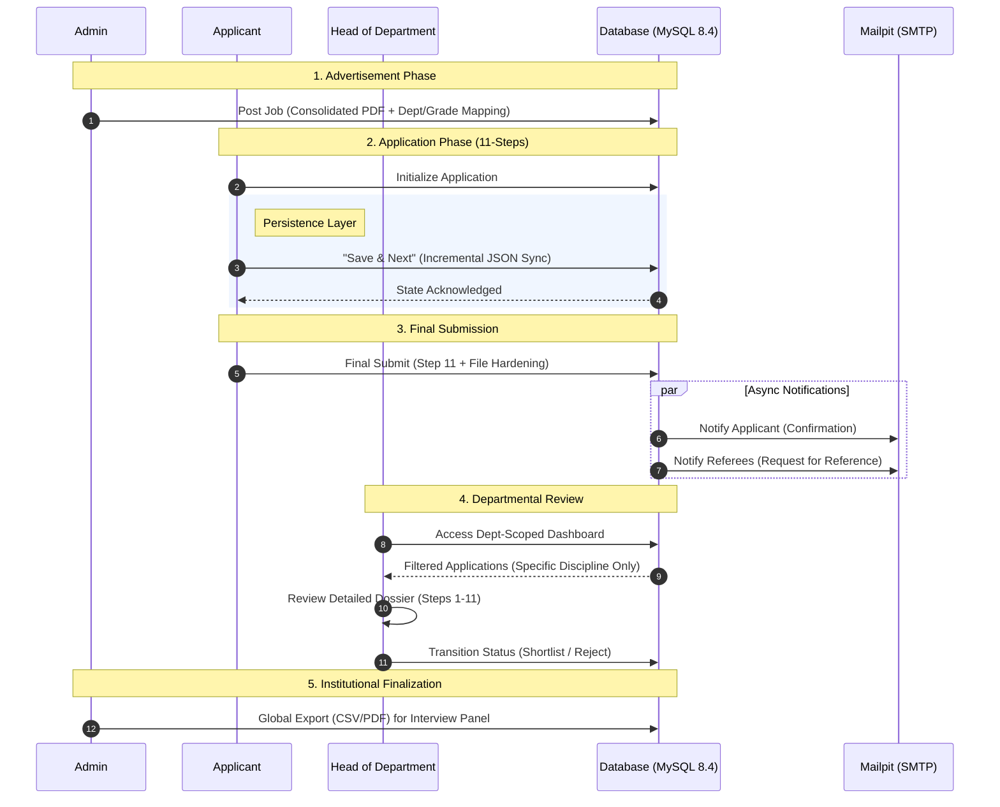

# Faculty Recruitment System (FRS)


FRS is an enterprise-grade recruitment engine designed to modernize academic hiring workflows through secure, state-persistent application pipelines. Built for IIT Indore, it empowers institutions to manage high-volume faculty applications with departmental precision, bridging the gap between complex data collection and rapid, role-based decision-making.

## Tech Stack

| Layer | Technology |
|------|-----------|
| Backend | Laravel 11 |
| Frontend | React (Inertia.js) |
| Styling | Tailwind CSS & Shadcn UI |
| Database | MySQL |
| DevOps | Docker (Laravel Sail) |

## System Architecture

The FRS is engineered for reliability and developer productivity, utilizing a modern monolithic approach with a decoupled frontend experience.

### The Inertia Bridge
This system leverages **Inertia.js** to bridge the gap between Laravel and React. This allows for a Single Page Application (SPA) feel without the complexity of maintaining a separate REST or GraphQL API. 
* **Global State:** The `HandleInertiaRequests` middleware automatically shares the authenticated user's profile and session flash messages (success/error) with the React frontend.
* **Server-Side Routing:** Routing is handled entirely by Laravel, with Inertia managing the component rendering on the client side.

### Dockerized Environment (Laravel Sail)
The entire development stack is containerized using **Laravel Sail**, ensuring environment parity across all development machines.
* **PHP Runtime:** PHP 8.5.
* **Database:** MySQL 8.4.
* **Email Testing:** Mailpit integration for capturing outgoing recruitment and referee notifications.
* **Utilities:** phpMyAdmin is included for direct database management during development.

### 11-Step Application State
To support the intensive data collection required for academic hiring, the system implements a robust "Save as Draft" mechanism.
* **Database Persistence:** Instead of ephemeral session storage, the system uses a `json` column (`form_data`) in the `job_applications` table to persist the state of all 11 steps.
* **Draft Logic:** The `RecruitmentController` uses an `updateOrCreate` strategy, allowing applicants to save their progress at any step without triggering full-form validation.
* **Data Casting:** Laravel's Eloquent casting automatically transforms the JSON blob into a manageable PHP array for the backend and a JSON object for the React frontend.

## Visual Workflow

The following Mermaid diagram illustrates the data flow and role interactions.



## Feature Deep-Dive

This section highlights the specialized functionalities implemented for each user role, focusing on the technical architecture of the recruitment lifecycle.

### Admin: Institutional Oversight

- **Advertisement Management**  
  Dynamic creation of job postings with support for consolidated PDF uploads and multi-department targeting.

- **Dynamic Discipline Configuration**  
  A full CRUD interface for managing the institution's department list, ensuring the recruitment pool stays aligned with academic restructuring.

- **HOD Assignment Matrix**  
  Granular control over faculty roles, allowing admins to promote users to HOD status and bind them to specific departmental silos.

- **Global Dossier Access**  
  Cross-departmental search and filtering of all submitted applications with bulk export capabilities for institutional reporting.

### Applicant: The 11-Step Wizard

- **State Persistence Layer**  
  Utilizes a `json` column (`form_data`) to store dense academic data (publications, patents, research plans), enabling a seamless "resume-anytime" draft experience.

- **Role-Specific Dashboard**  
  Real-time tracking of application statuses (*Submitted, Shortlisted, Rejected*) and a centralized hub for downloading generated dossiers.

- **Referee Automation**  
  Integrated dispatch of `RefereeNotification` emails to all listed referees via Mailpit-verified SMTP triggers upon finalization.

- **Export Engine**  
  On-the-fly generation of professionally formatted PDFs using `dompdf` and detailed Excel dossiers for personal record-keeping.

### HOD: Departmental Review 

- **Security Scoping**  
  Architectural implementation of departmental silos; HODs are locked into their assigned discipline via backend query scoping, preventing unauthorized access to other departments.

- **Dossier Deep-Dive**  
  A specialized review interface built with collapsible Shadcn/UI components to navigate complex 11-step applicant data efficiently.

- **Status Transition Workflow**  
  Single-click decision pipeline allowing HODs to move applicants from *"Awaiting Review"* to *"Shortlisted"* or *"Rejected"* states.

- **Committee Exports**  
  Ability to generate department-specific CSV summaries for offline review during faculty selection committee meetings.

## Installation 

Follow these steps to get the Faculty Recruitment System running locally using **Laravel Sail**.


### Prerequisites
- **Docker Desktop** installed and running  
- **Node.js & npm** installed on your host machine (for initial frontend builds)

---

### Step-by-Step Setup

#### 1. Clone the Repository & Environment Setup
```bash
git clone https://github.com/varunbalaji167/FRS_Laravel.git
cd frs_laravel
cp .env.example .env
```

---

#### 2. Install Dependencies  
Since the PHP environment is containerized, use a temporary container to install composer dependencies:

```bash
docker run --rm \
    -u "$(id -u):$(id -g)" \
    -v "$(pwd):/var/www/html" \
    -w /var/www/html \
    laravelsail/php84-composer:latest \
    composer install --ignore-platform-reqs
```

---

#### 3. Start the Environment  
Launch the Docker containers in the background:

```bash
./vendor/bin/sail up -d
```

The system uses **PHP 8.5** and **MySQL 8.4** as defined in `compose.yaml`.

---

#### 4. Initialize Database & Key
```bash
./vendor/bin/sail artisan key:generate
./vendor/bin/sail artisan migrate --seed
```

---

#### 5. Frontend Development  
Install React dependencies and start the Vite dev server:

```bash
./vendor/bin/sail npm install
./vendor/bin/sail npm run dev
```

---

### Access Ports
- **Web Application:** http://localhost 
- **Mailpit (Email Testing):** http://localhost:8025  
- **phpMyAdmin:** http://localhost:8080  

---

## Directory Structure

The frontend is organized to maintain a clear separation between reusable UI components, global layouts, and specific page logic. Below is the structure of the `resources/js` directory:

```text
resources/js
├── app.jsx                 # Inertia.js bootstrapper and React entry point
├── bootstrap.js            # Axios and environment configuration
├── Components/             # Reusable UI library
│   ├── ui/                 # Shadcn/UI primitive components (Button, Input, etc.)
│   ├── ToastListener.jsx   # Global handler for Inertia flash notifications
│   └── ...                 # Form inputs and navigation components
├── Layouts/                # Persistent shells for different user roles
│   ├── AdminLayout.jsx     # Navigation for Super Admins
│   ├── HodLayout.jsx       # Scoped navigation for Department Heads
│   ├── ApplicantLayout.jsx # Specialized layout for the recruitment wizard
│   └── GuestLayout.jsx     # Layout for unauthenticated pages (Login/Register)
├── lib/
│   └── utils.js            # Tailwind CSS and class-merging utilities
└── Pages/                  # View components mapped to Laravel routes
    ├── Admin/              # Global management: Applications, Jobs, and Users
    ├── Hod/                # Departmental Module: Review and Shortlisting
    ├── Applicant/          # Candidate Dashboard and the 11-Step Wizard
    │   └── Steps/          # Individual components for the application stages
    ├── Auth/               # Authentication views (Password Reset, Login, etc.)
    ├── Profile/            # Shared Master Profile and security settings
    ├── Dashboard.jsx       # Dynamic landing page based on authenticated role
    └── Welcome.jsx         # Public-facing landing page
```

## API Endpoints & Role-Based Logic Flow

This section provides a technical map of the system's communication layer, categorized by user role. Each endpoint follows the **Inertia.js protocol**, where the backend provides a JSON state that the React frontend renders into a seamless SPA experience.

---

### 1. Authentication Endpoints (Public & Guest)

These endpoints manage user access and identity verification using Laravel Breeze and Socialite.

#### Authentication Routes

| Method | Endpoint | Controller Function | Flow |
|--------|----------|--------------------|------|
| GET | `/register` | RegisteredUserController@create | User → Controller → Inertia renders `Auth/Register.jsx` |
| POST | `/register` | RegisteredUserController@store | User submits form → Validate → Create user in DB → Redirect to Dashboard |
| GET | `/login` | AuthenticatedSessionController@create | User → Controller → Inertia renders `Auth/Login.jsx` |
| POST | `/login` | AuthenticatedSessionController@store | Validate credentials → Start session → Redirect |
| POST | `/logout` | AuthenticatedSessionController@destroy | Invalidate session → Redirect to home |

---

#### Social Authentication (Google OAuth)

| Method | Endpoint | Controller Function | Flow |
|--------|----------|--------------------|------|
| GET | `/auth/google` | SocialAuthController@redirectToGoogle | Redirect to Google OAuth |
| GET | `/auth/google/callback` | SocialAuthController@handleGoogleCallback | Google → Controller → Fetch user → Login/Create → Redirect |

---

#### Password Management

| Method | Endpoint | Controller | Flow |
|--------|----------|------------|------|
| GET/POST | `/forgot-password` | PasswordController | Request password reset |
| GET/POST | `/reset-password` | PasswordController | Reset password via token |
| PUT | `/password` | PasswordController | Update existing password |

---

### 2. Profile Management Endpoints (Authenticated)

#### User Profile & Security

| Method | Endpoint | Controller Function | Flow |
|--------|----------|--------------------|------|
| GET | `/profile` | ProfileController@edit | Render Master Profile / Account Settings |
| PATCH | `/profile` | ProfileController@update | Update name/image → Role-based redirect |
| DELETE | `/profile` | ProfileController@destroy | Validate password → Delete user + associated data |

---

### 3. Applicant Recruitment Endpoints (Authenticated)

Handles the 11-step application process and applicant dashboard.

#### Applicant Features

| Method | Endpoint | Controller Function | Flow |
|--------|----------|--------------------|------|
| GET | `/dashboard` | RecruitmentController@index | Fetch advertisements → Check application status → Render dashboard |
| GET | `/my-applications` | RecruitmentController@myApplications | Fetch user applications → Format metadata → Render view |
| GET | `/jobs/{advertisement}/apply` | RecruitmentController@showApplyForm | Check draft → Render form with pre-filled data |

---

#### Application Actions

| Method | Endpoint | Controller Function | Flow |
|--------|----------|--------------------|------|
| POST | `/jobs/{advertisement}/draft` | RecruitmentController@saveDraft | Save partial data → `updateOrCreate` → Store as JSON draft |
| POST | `/jobs/{advertisement}/submit` | RecruitmentController@submitApplication | Validate → Store files → Update status → Trigger emails |
| GET | `/applications/{id}/export/pdf` | RecruitmentController@exportPdf | Generate PDF → Stream download |

---
### 4. Administrative Management Endpoints (Admin Only)

Restricted via **`CheckRole` middleware**.

#### Admin Dashboard, Users & Departments

| Method | Endpoint | Controller Function | Flow |
|--------|----------|--------------------|------|
| GET | `/admin/dashboard` | AdminController@dashboard | Aggregate global stats → Render Super Admin dashboard |
| GET | `/admin/users` | AdminController@users | Fetch HODs/Applicants → Render management list |
| GET | `/admin/settings` | AdminController@settings | Fetch departments → Render department management UI |
| POST | `/admin/departments` | AdminController@storeDepartment | Validate name → Create new academic department |
| DELETE | `/admin/departments/{id}` | AdminController@destroyDepartment | Remove department → Return to settings |

---

#### Job & Global Application Management

| Method | Endpoint | Controller Function | Flow |
|--------|----------|--------------------|------|
| GET | `/admin/jobs` | RecruitmentController@index | List all active/inactive advertisements |
| POST | `/admin/jobs` | RecruitmentController@store | Validate → Store PDF → Map Departments/Grades → Publish |
| GET | `/admin/applications` | Admin\ApplicationController@index | Fetch all submitted applications (cross-department) |
| GET | `/admin/applications/{id}` | Admin\ApplicationController@show | Retrieve full 11-step dossier → Render read-only view |

---

### 5. Departmental Review Endpoints (HOD Only)

Restricted to users with the **`hod` role**, scoped to their assigned department.

| Method | Endpoint | Controller Function | Flow |
|--------|----------|--------------------|------|
| GET | `/hod/dashboard` | AdminController@dashboard | Fetch department-scoped stats → Render HOD dashboard |
| GET | `/hod/applications` | Admin\ApplicationController@index | List applications for HOD's department only |
| GET | `/hod/applications/{id}` | Admin\ApplicationController@show | Detailed review of departmental applicant dossier |
| PATCH | `/hod/applications/{id}` | Admin\ApplicationController@updateStatus | Transition status (*Shortlisted / Rejected*) |

---

### 6. Background Logic & Notifications

These processes are **decoupled from the UI** and triggered by lifecycle events.

#### Mail Services

| Service | File | Flow |
|--------|------|------|
| ApplicationSubmitted | `app/Mail/ApplicationSubmitted.php` | Triggered on final submission → Sends confirmation + PDF |
| RefereeNotification | `app/Mail/RefereeNotification.php` | Triggered on submission → Requests referee recommendations |

---

#### Storage & Export Logic

| Type | Path / Engine | Description |
|------|--------------|-------------|
| Profile Images | `storage/app/public/profiles/{user_id}` | Linked to user profile and application dossier |
| Certificates | `storage/app/public/applications/{user_id}/{adv_id}/` | Scoped storage per user and advertisement |
| PDF Generation | `dompdf` | Generates consolidated 11-step application for review |

---
